# target-bigquery

A [Singer](https://singer.io) target that writes data to Google BigQuery.

[](https://github.com/adswerve/target-bigquery/actions/workflows/python-package.yml)

`target-bigquery` works together with any other [Singer Tap] to move data from sources like [Braintree], [Freshdesk]
and [Hubspot] to Google BigQuery.

## Contents

- [Contact](#contact)
- [Dependencies](#dependencies)
- [How to use it](#how-to-use-it)
    - [Step 1: Enable Google BigQuery API](#step-1-enable-google-bigquery-api)
    - [Step 2: Authenticate with a service account](#step-2-authenticate-with-a-service-account)
    - [Step 3: Configure](#step-3-configure)
        - [Target config file](#target-config-file)
        - [Tap config files](#tap-config-files)
    - [Step 4: Install and run](#step-4-install-and-run)
    - [Step 5: target-tables-config file: set up partitioning and clustering](#step-5-target-tables-config-file-set-up-partitioning-and-clustering)
        - [Partitioning background](#partitioning-background)
        - [Clustering background](#clustering-background)
        - [Setting up partitioning and clustering](#setting-up-partitioning-and-clustering)
    - [Step 6: target-tables-config file: force data types and modes](#step-6-target-tables-config-file-force-data-types-and-modes)
- [Unit tests set up](#unit-tests-set-up)
- [Config files in this project](#config-files-in-this-project)

## Contact

Email: `analytics-help@adswerve.com`

## Dependencies

Install requirements, using either of the two methods below.

**Method 1**

```
pip install -r requirements.txt 
```

**Method 2**

Alternatively, you can run the following command. It runs *setup.py* and installs target-bigquery into the env like the
user would. **-e** emulates how a user of the package would install requirements.

```
pip install -e .
```

**Additional development and testing requirements**

Install additional dependencies required for development and testing.

```
pip install -r dev-requirements.txt
```

## How to use it

### Step 1: Enable Google BigQuery API

1. [GCP web console](https://console.cloud.google.com/) -> **API & Services** -> **Library**

<!--  -->

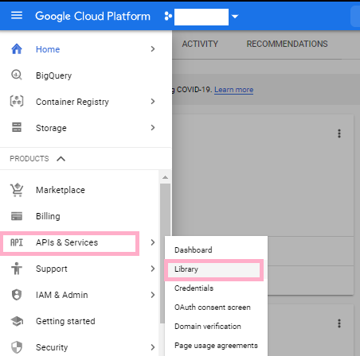 API & Services -> Library">

2. Search for **BigQuery API** -> click **Enable**

<!--  -->

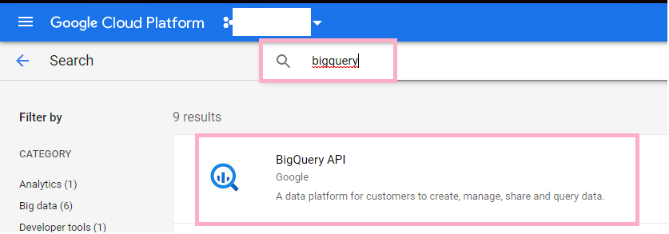

<!--  -->

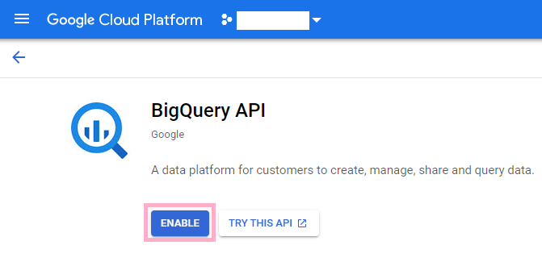

### Step 2: Authenticate with a service account

It is recommended to use `target-bigquery` with a service account.

Create a service account credential:

1. **API & Services** -> **Credentials** -> **Create Credentials** -> **Service account**

<!--  -->

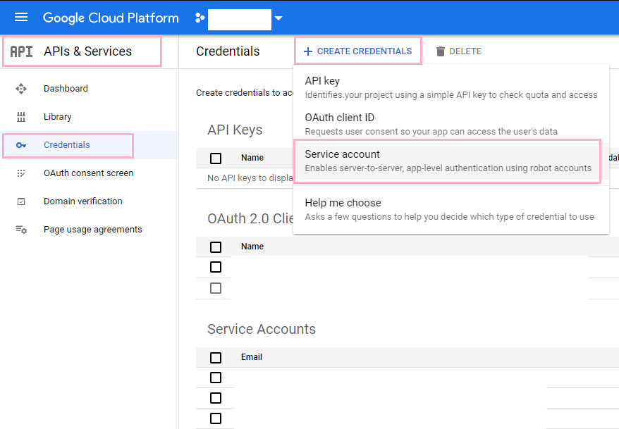 Credentials -> Create Credentials -> Service account">

2. Under **Service account details**, enter **Service account name**. Click **Create**

<!--  -->

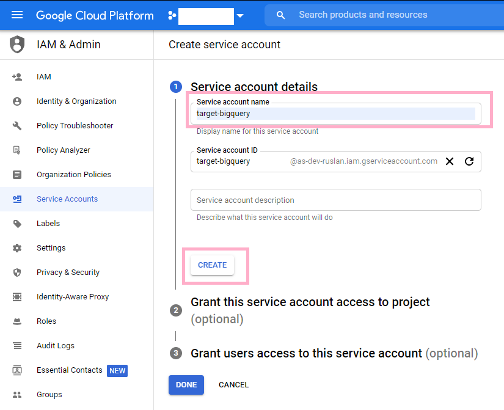

3. Under **Grant this service account access to the project**, select **BigQuery Data Editor** and **BigQuery Job User**
   as the minimal set of permissions. Click **Done**

- **BigQuery Data Editor** permission allows the service account to access (and change) the data.
- **BigQuery Job User** permission allows the service account to actually run a load or select job.

<!--  -->

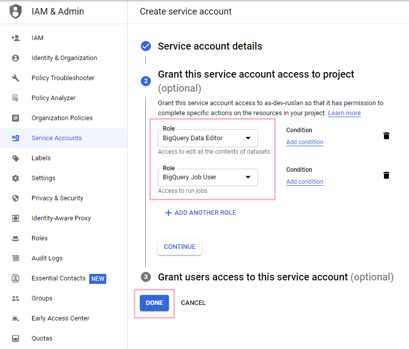

4. On the **API & Services Credentials** screen, select the service account you just created.

<!--  -->

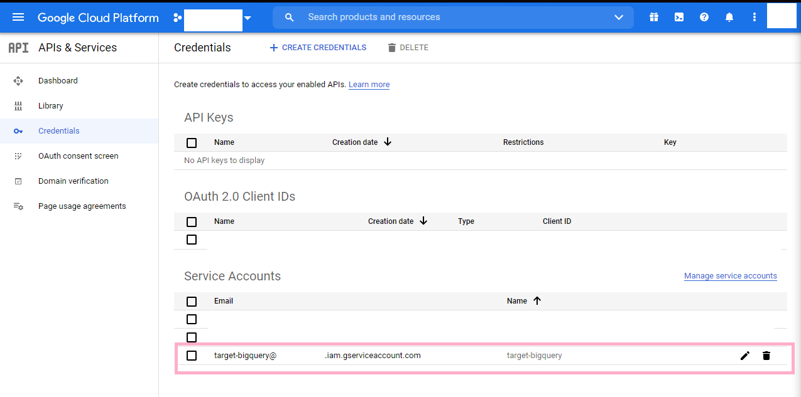

5. Click **ADD KEY** -> **Create new key** -> **JSON key**. Download the service account credential JSON file.

<!--  -->

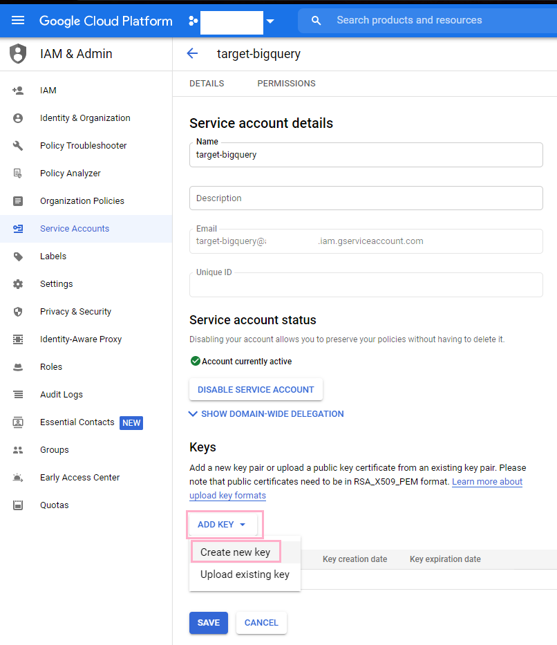 Create new key">

<!--  -->

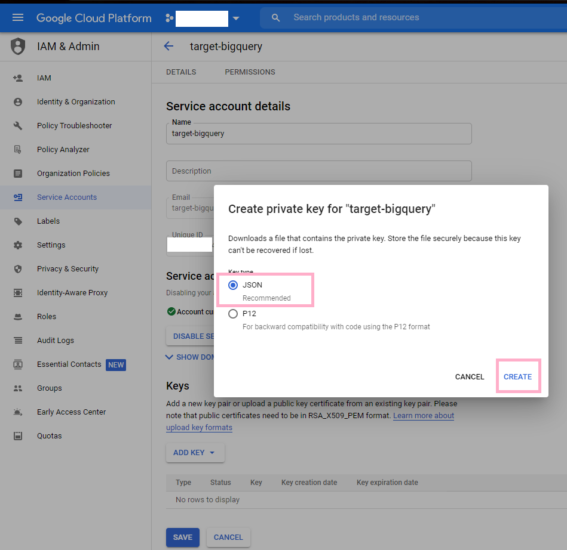

<!--  -->

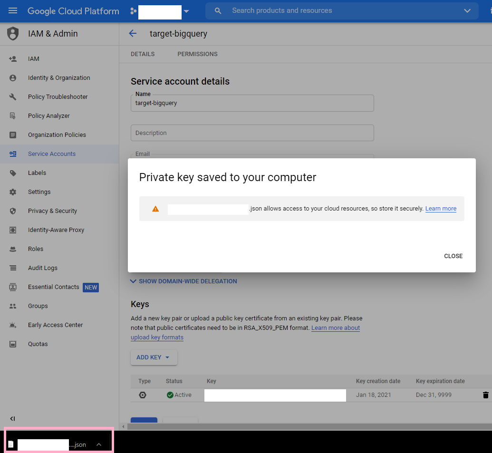

6. Name the file **client_secrets.json**. You can place the file where `target-bigquery` will be executed or provide a
   path to the service account json file.

7. Set a **GOOGLE_APPLICATION_CREDENTIALS** environment variable on the machine, where the value is the fully qualified
   path to **client_secrets.json** file:

- [Creating an environment variable on a Windows 10 machine](https://www.architectryan.com/2018/08/31/how-to-change-environment-variables-on-windows-10/)
- [Creating an environment variable on a Mac machine](https://medium.com/@himanshuagarwal1395/setting-up-environment-variables-in-macos-sierra-f5978369b255)

### Step 3: Configure

#### Target config file

Create a file called **target-config.json** in your working directory, following this
sample [target-config.json](/sample_config/target-config-exchange-rates-api.json) file (or see the example below).

- Required parameters are the project name `project_id` and `dataset_id`.
- Optional parameters are `table_suffix`, `validate records`, `add_metadata_columns`, `location` and `table_config`.
- Default data location is "US" (if your location is not the US, you can indicate a different location in your **
  target-config.json** file).
- The data will be written to the dataset specified in your **target-config.json**.
- If you do not have the dataset with this name yet, it will be created.
- The table will be created.
- There's an optional parameter `replication_method` that can either be:
    * `append`: Adding new rows to the table (Default value)
    * `truncate`: Deleting all previous rows and uploading the new ones to the table
    * `incremental`: **Upserting** new rows into the table, using the **primary key** given by the tap connector
      (if it finds an old row with same key, updates it. Otherwise it inserts the new row)
 - WARNING: We do not recommend using `incremental` option (which uses `MERGE` SQL statement). It might result in loss of production data, because historical records get updated. Instead, we recommend using the `append` replication method, which will preserve historical data. 

Sample **target-config.json** file:

```
{
    "project_id": "{your_GCP_project_id}",
    "dataset_id": "{your_dataset_id}",
    "table_suffix": "_sample_table_suffix",
    "validate_records": true,
    "add_metadata_columns": true,
    "location": "EU",
    "table_config": "target-tables-config.json"
}
```

#### Tap config files

This is a little bit outside of the scope of this documentation, but let's quickly take a look at sample *tap* config
files as well, to see how tap and target work together.

Sample [tap-config.json](/sample_config/tap-config-exchange-rates-api.json) file configures the data source:

```
{   "base": "USD",
    "start_date": "2021-01-01"
}
```

- Sample [state.json](/sample_config/state.json) file is now just a empty JSON file `{}`, and it will be written or
  updated when the tap runs.
- This is an optional file.
- The tap will write the date into **state.json** file, indicating when the data loading stopped at.
- Next time you run the tap, it'll continue from this date in the state file. If **state.json** file is provided, then
  it takes presedence over the "start_date" in the tap config file.

Learn more: https://github.com/singer-io/getting-started

### Step 4: Install and run

1. First, make sure Python 3 is installed on your system or follow these installation instructions for [Mac](python-mac)
   or [Ubuntu](python-ubuntu).

2. `target-bigquery` can be run with any [Singer Tap], but we'll use [tap-exchangeratesapi] - which pulls currency
   exchange rate data from a public data set - as an example. (Learn more
   about [Exchangeratesapi.io](http://exchangeratesapi.io/))

3. In the **target-config.json** file, enter the id of your GCP (Google Cloud Platform Project) - you can find it on the
   Home page of your [GCP web console](https://console.cloud.google.com).

Sample **target-config.json** file:

```
{
    "project_id": "{your project id}",
    "dataset_id": "exchangeratesapi"
}
```

4. These commands will install `tap-exchangeratesapi` and `target-bigquery` with pip and then run them together, piping
   the output of `tap-exchangeratesapi` to `target-bigquery`.

We recommend that you **install tap and target in their own virtual environments.** It will be easier to manage
requirements and avoid dependency conflicts.

- The commands below are for running locally on a Windows machine. For a Mac or Linux machine, the syntax will be
  slightly different.

```bash
cd "{your project root directory}"

# upgrade pip
# Windows:
py -m pip install --upgrade pip 
# Linux: 
# python3 -m pip install --upgrade pip

# create a virtual env for tap
# Windows:
py -m venv tap
# Linux:
# python3 -m venv /pyenv/tap

# activate the virtual env and install tap 
# Windows:
.\tap\Scripts\activate && pip install tap-exchangeratesapi==0.1.1

# create a virtual env for target
# Windows: 
py -m venv target
# Linux:
# python3 -m venv /pyenv/target

# activate the virtual env and install target
.\target\Scripts\activate && pip install git+git://github.com/adswerve/target-bigquery

# load data

{project_root_dir}\tap\Scripts\tap-exchangeratesapi --config sample_config/tap-config-exchange-rates-api.json | ^
{project_root_dir}\target\Scripts\target-bigquery --config  sample_config/target-config-exchange-rates-api.json > sample_config/state.json
# if directory has spaces, you can use quotes:
# "{project root dir with spaces}\tap\Scripts\tap-exchangeratesapi" 
# ^ on a Windows machine indicates a new line. On a Mac, use "\\".
```

- If you're using a different tap, substitute `tap-exchangeratesapi` in the final command above to the command used to
  run your tap.

### Step 5: target-tables-config file: set up partitioning and clustering

### Partitioning background

A [partitioned table](https://cloud.google.com/bigquery/docs/partitioned-tables) is a special table that is divided into
segments, called partitions, that make it easier to manage and query your data. By dividing a large table into smaller
partitions, you can:

- improve query performance,
- control costs by reducing the number of bytes read by a query.

You can partition BigQuery tables by:

- Ingestion time: Tables are partitioned based on the data's ingestion (load) time or arrival time.

- Date/timestamp/datetime: Tables are partitioned based on a TIMESTAMP, DATE, or DATETIME column.

- Integer range: Tables are partitioned based on an integer column.

### Clustering background

- When you create a clustered table in BigQuery, the table data is automatically organized based on the contents of one
  or more columns in the table’s schema.
- The columns you specify are used to colocate related data.
- When you cluster a table using multiple columns, the order of columns you specify is important. The order of the
  specified columns determines the sort order of the data.
- Clustering can improve the performance of certain types of queries such as queries that use filter clauses and queries
  that aggregate data.
- You can cluster up to 4 columns in a table

**Learn more about BigQuery partitioned and clustered tables:**

https://cloud.google.com/bigquery/docs/partitioned-tables

https://cloud.google.com/bigquery/docs/clustered-tables

https://medium.com/google-cloud/bigquery-optimized-cluster-your-tables-65e2f684594b

https://medium.com/analytics-vidhya/bigquery-partitioning-clustering-9f84fc201e61

### Setting up partitioning and clustering

**Example 1: [tap-recharge] data**

This is not a follow-along example. Additional tap configuration would be required to run it. This example is just for
illustration purposes.

If we were to load [tap-recharge] *charges* table into BigQuery, we could partition it by date.

For clustering, we can selected:

- foreign keys and
- columns likely to appear in `WHERE` and `GROUP BY` statements

To configure partitioning and clustering in BigQuery destination tables, we create **target-tables-config.json**:

```
{
    "streams": {
      "charges": {
        "partition_field": "updated_at",
        "cluster_fields": ["type", "status", "customer_id", "transaction_id"]
      }
    }
}
```

We can verify in BigQuery web UI that partitioning and clustering worked:

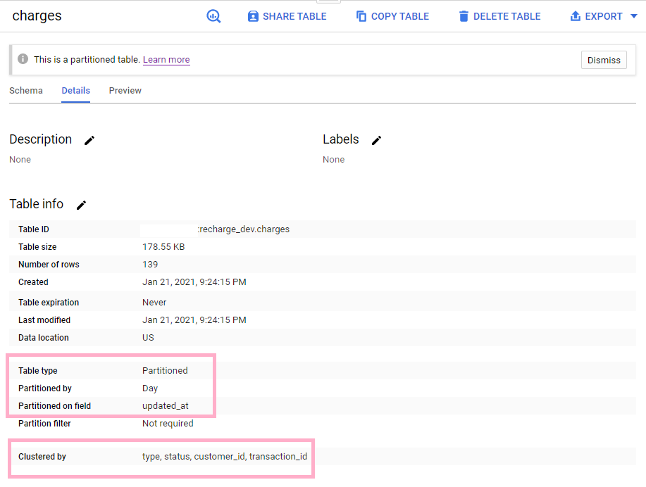

**Example 2: [tap-exchangeratesapi] data**

You can follow along and try this example on your own. We will continue where we left off in **Step 4: Install and Run**
above.

1. Take a look at our [tap-exchangeratesapi] data. We have:

- dates
- datetimes
- floats which show exchange rates

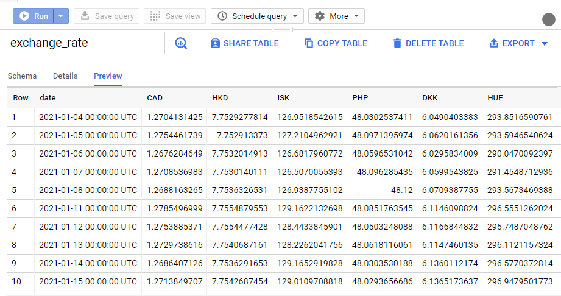

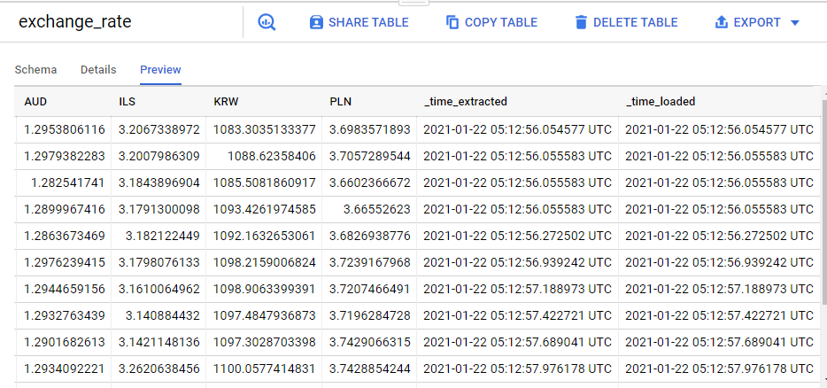

In our [tap-exchangeratesapi] example, no columns are good candidates for clustering.

You can only set up partitioning.

2. Create your **target-tables-config.json** with partitioning configuration. Leave cluster fields blank:

```
{
    "streams": {
      "exchange_rate": {
        "partition_field": "date",
        "cluster_fields": []
      }
}}
```

3. Clear you **state.json**, so it's an empty JSON `{}`, because we want to load all data again. Skip this step, if you
   didn't previously load this data in **Step 4** above.

4. Delete your BigQuery destination table **exchangeratesapi**, because we want to re-load it again from scratch. Skip
   this step, if you didn't previously load this data in **Step 4** above.

3. Load data data into BigQuery, while configuring target tables. Pass **target-tables-config.json** as a command line
   argument.

```bash
{project_root_dir}\tap\Scripts\tap-exchangeratesapi --config sample_config/tap-config-exchange-rates-api.json | ^
{project_root_dir}\target\Scripts\target-bigquery --config  sample_config/target-config-exchange-rates-api.json ^
-t sample_config/target-tables-config-exchange-rates-api.json > sample_config/state.json
```

- "^" indicates a new line in Windows Command Prompt. In Mac terminal, use "\\".
- If you don't want to pass **target-tables-config.json** file as a CLI argument, you can
  add ```"table_config": "target-tables-config.json"``` to your **target-config.json** file. See **Step 3: Configure**
  above.


6. Verify in BigQuery web UI that partitioning and clustering worked (in our example below, we only set up
   partitioning):

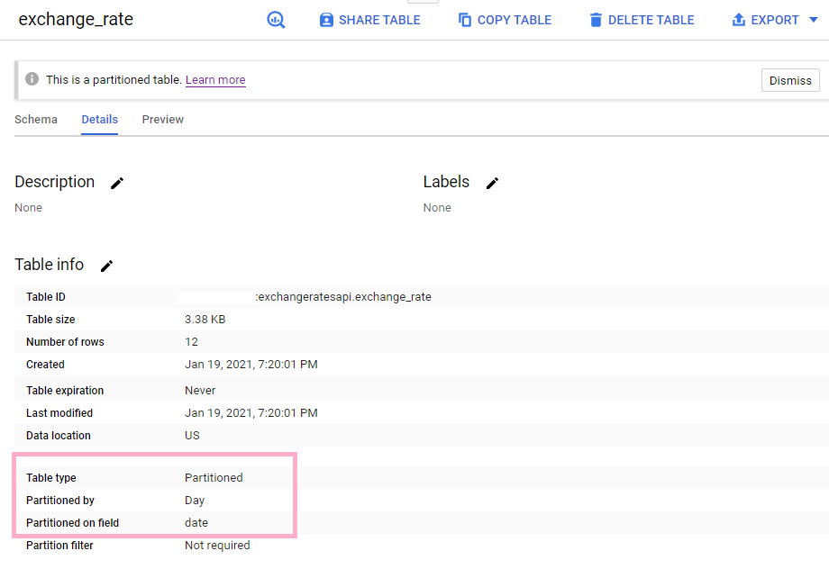

### Step 6: target-tables-config file: force data types and modes

#### Problem:

- Normally, tap catalog file governs schema of data which will be loaded into target-bigquery.
- However, sometimes you can get a column of an undesired data type, which is not following your tap-catalog file.

#### Solution:

- You can force that column to the desired data type by using `force_fields` flag inside your *
  target-tables-config.json* file.

#### Example:

- We used this solution to fix `"date_start"` field from `"ads_insights_age_and_gender"` stream from tap-facebook.
- In tap catalog file, we said we wanted this column to be a **date**.
- However, the tap generates schema where this column is a **string**, despite our tap catalog file.
- Therefore, we used `force_fields` flag in target-tables-config.json to override what the tap generates and force the
  column to be a date.
- Example of *target-tables-config.json* file:

```
{
    "streams": {
      "ads_insights_age_and_gender": {
        "partition_field": "date_start",
        "cluster_fields": ["age", "gender","account_id", "campaign_id"],
        "force_fields": {
          "date_start": {"type": "DATE", "mode":  "NULLABLE"},
          "date_stop": {"type": "DATE", "mode":  "NULLABLE"}
        }
      }
    }
}
```

## Unit tests set up

Add the following files to *sandbox* directory under project root directory:

- **sa.json** with GCP credential

- **target-config.json**:

  ```
  {
    "project_id": "{your-project-id}",
    "dataset_id": "{your_dataset_id}"
  }
  ```

- **target_config_cache.json**:
  ```
  {
    "project_id": "{your-project-id}",
    "dataset_id": "{your_dataset_id}",
    "replication_method": "truncate",
    "max_cache": 0
  }
  ```

- **target_config_cache_append.json**:
  ```
  {
    "project_id": "{your-project-id}",
    "dataset_id": "{your_dataset_id}",
    "replication_method": "append",
    "max_cache": 0
  }
  ```
  OR
  ```
  {
    "project_id": "{your-project-id}",
    "dataset_id": "{your_dataset_id}",
    "max_cache": 0
  }    
  ```

- **target_config_contains_target_tables_config.json**

    - if you're running unit test from the unit test .py file:

      ``` 
      {
        "project_id": "{your-project-id}",
        "dataset_id": "{your_dataset_id}",
        "table_config": "rsc/config/simple_stream_table_config.json"
      }      
      ```

    - if you're running unit test from shell, for example:

      ```bash
      pytest --verbose tests/test_simplestream.py::TestSimpleStreamLoadJob::test_simple_stream_with_tables_config_passed_inside_target_config_file
      ```

      In this case, here's your config file, notice the difference in directory:
      ``` 
      {
        "project_id": "{your-project-id}",
        "dataset_id": "{your_dataset_id}",
        "table_config": "tests/rsc/config/simple_stream_table_config.json"
      }
      ``` 

- **malformed_target_config.json**:

  ```
  {
    "project_id": "{your-project-id}",
    "dataset_id": "{your_dataset_id}",
    "validate_records":  false
  }     
    ```

- **target_config_merge_state_false_flag.json**:
  ```
  {
    "project_id": "{your-project-id}",
    "dataset_id": "{your_dataset_id}",
    "merge_state_messages": 0
  }     
    ```

- **target_config_incremental.json**:

  ```
  {
    "project_id": "{your-project-id}",
    "dataset_id": "{your_dataset_id}",
    "replication_method": "incremental"
  }
  ```

## Config files in this project

This project has three locations with config files:

1) **sample_config** - sample config files to illustrate points made in this README
2) **tests/rsc/config** - config files necessary for unit tests
3) **sandbox** - config files you create for unit tests. We didn't include them because they have sensitive info (e.g.,
   GCP project names). Follow instructions in the section **Unit tests set up**, as well as comments in unit tests.

---

[Singer Tap]: https://singer.io

[Braintree]: https://github.com/singer-io/tap-braintree

[Freshdesk]: https://github.com/singer-io/tap-freshdesk

[Hubspot]: https://github.com/singer-io/tap-hubspot

[tap-exchangeratesapi]: https://github.com/singer-io/tap-exchangeratesapi

[python-mac]: http://docs.python-guide.org/en/latest/starting/install3/osx/

[python-ubuntu]: https://www.digitalocean.com/community/tutorials/how-to-install-python-3-and-set-up-a-local-programming-environment-on-ubuntu-16-04

[tap-recharge]: https://github.com/singer-io/tap-recharge